# WafRift Architecture

A single-page reference for contributors and reviewers. Reading time: ~5 minutes.

---

## One-paragraph intent

WafRift is a programmable WAF-evasion engine. Given an attack payload and a
target, it applies encoding × grammar mutation × HTTP smuggling × content-type
confusion × TLS fingerprint rotation in an adaptive feedback loop (hill-climb /
simulated annealing / tabu / novelty search / MAP-Elites) to discover what
bypasses the exact WAF stack in front of the target, then persists the winning
technique chains to a per-WAF gene bank so every subsequent scan against the
same WAF family starts with zero discovery. It also ships active-learning WAF
decompilation (`wafrift model-evade`): L\* membership queries reconstruct the
WAF's decision boundary as a symbolic finite automaton, and bypass candidates
are mined offline against that automaton at ~1 M/s — turning evasion from
search into deduction.

---

## Crate dependency graph

```mermaid
graph TD
  types["wafrift-types\n(Foundation)"]
  encoding["wafrift-encoding"]
  grammar["wafrift-grammar"]
  ct["wafrift-content-type"]
  smuggling["wafrift-smuggling"]
  fp["wafrift-fingerprint"]
  detect["wafrift-detect"]
  evolution["wafrift-evolution"]
  wafmodel["wafrift-wafmodel"]
  oracle["wafrift-oracle"]
  strategy["wafrift-strategy"]
  transport["wafrift-transport"]
  pool["wafrift-pool"]
  recon["wafrift-recon"]
  genome["wafrift-genome-registry"]
  graphql["wafrift-graphql"]
  h3["wafrift-http3-evasion"]
  grpc["wafrift-grpc-evasion"]
  cf["wafrift-captchaforge-bridge"]
  plugin["wafrift-plugin-api"]
  core["wafrift-core\n(Façade)"]
  proxy["wafrift-proxy"]
  cli["wafrift-cli"]

  types --> encoding
  types --> grammar
  types --> ct
  types --> smuggling
  types --> fp
  types --> detect
  types --> evolution
  types --> oracle
  types --> strategy
  types --> transport
  types --> recon
  grammar --> oracle
  grammar --> evolution
  encoding --> strategy
  grammar --> strategy
  ct --> strategy
  smuggling --> strategy
  fp --> strategy
  detect --> strategy
  oracle --> strategy
  evolution --> strategy
  wafmodel --> strategy
  transport --> strategy
  pool --> transport
  transport --> proxy
  transport --> cli
  strategy --> cli
  detect --> cli
  recon --> cli
  genome --> cli
  graphql --> cli
  h3 --> cli
  grpc --> strategy
  grpc --> cli
  cf --> transport
  plugin --> strategy
  plugin --> cli
  core --> cli
  proxy --> cli
```



---

## `wafrift-encoding` internal layout

Every module in this crate is a **WAF-evasion primitive**: it transforms
a payload so the WAF's matcher misses it while the origin's parser still
recovers the original. Origin-level attack payloads (SQLi/XSS/SSTI/JWT/
LDAP/etc) live in sibling Santh tools, not here.

Modules under `crates/encoding/src/encoding/`:

- `url`, `unicode`, `keyword`, `structural`, `layered`, `strategy` —
  classic encoding strategies registered in the `Strategy` enum
- `invisible` — Plan 9 tag chars / variation selectors / stylistic
  ligatures / soft hyphens / word joiners (defeats keyword regex)
- `path_norm` — RFC 3986 §5.2.4 differential normalization variants
  (WAF↔origin path parser disagreement)
- `request_line` — exotic methods, version strings, absolute-form /
  asterisk-form / authority-form URIs (WAF↔origin request-line parser
  disagreement)
- `race` — Kettle BH23 single-packet attack frame builders
- `method_override` — `X-HTTP-Method-Override` / `_method` framework
  re-interpret tricks (WAF sees POST, framework executes DELETE/PUT)
- `cache_poison` — `X-Forwarded-*`, web cache deception paths, Vary
  header confusion, cache-key normalization variants

Adding a new evasion primitive: one file + one line in `mod.rs`.

---

## Layer table

| Layer | Crate | One-line role |
|---|---|---|
| **Foundation** | `wafrift-types` | Shared types: `Request`, `Technique`, `EvasionResult`, `Verdict`, `EvasionConfig` |
| **Wire-level mutators** | `wafrift-encoding` | 40+ encoding strategies (URL ×3, Unicode, HTML entity, SQL comment, chunked, invisible chars, base64, hex, gzip/deflate, UTF-7, IIS %u, JSON-string, fullwidth, homoglyph, parameter pollution, …) |
| | `wafrift-grammar` | Grammar-aware mutations — SQL, XSS, CMD, SSTI, path, LDAP, SSRF; variants validate against `sqlparser-rs` AST |
| | `wafrift-content-type` | WAFFLED Content-Type switching — JSON / XML / multipart / form reformatting |
| | `wafrift-smuggling` | CL.TE / TE.CL / TE.TE / CL.0 / H2C / WebSocket smuggling; safe + unsafe-probes feature gate |
| | `wafrift-fingerprint` | Browser UA + TLS JA3/JA4 profile rotation (Chrome, Firefox, Safari, Edge, OkHttp) |
| | `wafrift-graphql` | GraphQL-specific evasion: alias flood, op-name mismatch, introspection whitespace-split |
| | `wafrift-http3-evasion` | QUIC/HTTP3 data-plane primitives: QPACK desync, 0-RTT replay, CID rotation, stream priority topology, MTU fragmentation |
| | `wafrift-grpc-evasion` | gRPC opaque-payload bypass: protobuf framing, nested submessages, field-split fragmentation — bypasses WAFs that skip `application/grpc` bodies as binary |
| **Intelligence** | `wafrift-detect` | WAF fingerprinting via HTTP headers + body (160+ vendor rules), DNS CNAME chain, reverse-DNS PTR, BGP ASN |
| | `wafrift-evolution` | Genetic algorithm, MCTS, differential probing, body-padding (inspection-window evasion), WAF-aware advisor |
| | `wafrift-wafmodel` | Active-learning WAF decompiler: L\* / SFA reconstruction, offline bypass mining, ML-WAF evasion, hole-closure synthesis |
| | `wafrift-oracle` | Payload-validity oracles — SQL AST, XSS structure, SSTI delimiters, CMDI shell syntax, path traversal, LDAP, SSRF |
| **Pipeline** | `wafrift-strategy` | Evasion pipeline orchestrator: per-host state (`HostState`), winner rotation, gene bank, MCTS bridge, ML-WAF routing |
| **Runtime** | `wafrift-transport` | Evasion-aware reqwest wrapper: auto-retry, WAF-block detection, session coherence, stealth profiles (`StealthClient`) |
| | `wafrift-pool` | Round-robin HTTP/SOCKS5 proxy pool |
| | `wafrift-recon` | Origin discovery: CT logs (crt.sh), DNS history, CDN/WAF IP filtering |
| | `wafrift-genome-registry` | ed25519 genome signing, `TrustList` publisher allowlist, bundle wire format |
| | `wafrift-captchaforge-bridge` | Headless Chromium adapter (chromiumoxide) for Cloudflare/Akamai/AWS managed challenge solving |
| | `wafrift-plugin-api` | External tamper SDK: TOML regex-substitution rules + wasmtime-sandboxed `wasm32-wasip1` modules. No syscalls, no network, no filesystem, 1 M fuel + 512 KiB stack cap |
| **Frontend** | `wafrift-core` | Façade crate — re-exports all crates under one namespace for `wafrift-core = "0.2"` consumers |
| | `wafrift-proxy` | Forward HTTP proxy with per-host adaptive evasion, MITM/TLS interception, ratatui TUI |
| | `wafrift-cli` | Binary entry point — all subcommands, `Commands` enum, scan / bench / parser-diff / smuggle / legendary |

---

## Where to add a new X

| What | Where |
|---|---|
| New **WAF-evasion primitive** (encoder, request-line trick, path differential, smuggling primitive, cache-poison header, …) | `crates/encoding/src/encoding/` — add a function, register in the `Strategy` enum in `strategy.rs`. Examples: `invisible.rs`, `path_norm.rs`, `request_line.rs`, `race.rs`, `method_override.rs`, `cache_poison.rs`. **Origin-level attack payloads do NOT belong in wafrift.** |
| New **payload grammar** (mutation engine for a class) | `crates/grammar/src/grammar/` — add a mutator, extend `PayloadType` + `mutate_as`, add a semantic oracle in `crates/oracle/src/` |
| New **smuggling primitive** | `crates/smuggling/src/smuggling.rs` (CL.TE family) or sibling file (`rapid_reset.rs`, `ws_fragmentation.rs`, `sse_smuggle.rs`) — add a builder function |
| New **plugin / tamper** (no Rust rebuild) | `~/.wafrift/tampers/*.toml` for regex-substitution, `~/.wafrift/tampers/*.wasm` for arbitrary logic. See `docs/PLUGIN_API.md` |
| New **WAF detection rule** | `rules/detect/<vendor>.toml` — five lines of TOML, zero Rust knowledge required |
| New **CLI subcommand** | `crates/cli/src/<name>_cmd.rs` (args struct + `run_<name>`) and add a variant to the `Commands` enum in `main.rs` |
| New **oracle** | `crates/oracle/src/<type>.rs` implementing `PayloadOracle`; register in `oracle_for()` in `lib.rs` |
| New **evolution algorithm** | `crates/evolution/src/search/` — implement `SearchAlgorithm`; wire into `EvolutionEngine::with_algorithm` |
| New **GraphQL evasion payload** | `crates/graphql/src/lib.rs` — add a `pub fn` and include it in `all_evasion_payloads()` |
| New **HTTP/3 technique** | `crates/http3-evasion/src/` — add a module, export from `lib.rs`, add a variant to `EvasionTechnique` |
| New **gRPC technique** | `crates/grpc-evasion/src/lib.rs` — add a `pub fn` following `wrap_in_grpc_frame` / `embed_attack_in_nested` |
| New **bench scenario** | `wafrift-bench/corpus/` — TOML case file; format documented in `wafrift-bench/methodology.md` |

---

## CLI subcommand index

### Recon
| Subcommand | Role |
|---|---|
| `detect` | Fingerprint WAF/CDN/origin (HTTP headers, DNS CNAME, reverse-DNS, BGP ASN) |
| `discover` | Parse OpenAPI / GraphQL introspection / mine parameters into injection points |
| `recon` | Origin discovery via CT logs + DNS history (authorized targets only) |
| `origin-hints` | DNS hints for origin-bypass (authorized targets only) |
| `probe` | Generate differential analysis probes |

### Scan
| Subcommand | Role |
|---|---|
| `scan` | Fire evasion variants at a live target; report bypass chains; stateful session support |
| `bypass-probe` | 230 auth-bypass header probes + path/method variants (Tsai-class) |
| `evade` | Offline payload mutation — no target required |
| `import-curl` | Parse a Burp "Copy as cURL" capture and run scan |

### Parser-diff family
| Subcommand | Role |
|---|---|
| `diff <kind>` | **(primary verb; replaces the deprecated commands below)** Unified differential surface — one entry point for all parser-disagreement probes. Kinds: `path`, `header`, `body`, `query`, `cache`, `h2`, `method`, `gql`, `jwt`, `cors`, `trailer`, `ja3`, `all` (the seven path/header/body/query/cache/h2/method probes only — NOT gql/jwt/cors/trailer). |
| `attack` | Unified orchestrator — runs all seven parser-diff probes concurrently **(deprecated alias — use `diff all`)** |
| `parser-diff` | URL-path shape variants (NUL, fullwidth slash, dot-segment, …) **(deprecated alias — use `diff path`)** |
| `header-diff` | Header-block variants (dup-header, XFF, LWS, Authorization case-mix) **(deprecated alias — use `diff header`)** |
| `body-diff` | Body-format variants (JSON dup-key, UTF-7, BOM, multipart collision) **(deprecated alias — use `diff body`)** |
| `query-diff` | Query-string variants (HPP, bracket notation, semicolon separator) **(deprecated alias — use `diff query`)** |
| `cache-diff` | Cache-key confusion (Host case, param order, fragment leak) **(deprecated alias — use `diff cache`)** |
| `h2-diff` | HTTP/1.1 vs HTTP/2 differential **(deprecated alias — use `diff h2`)** |
| `method-diff` | HTTP method variants (WebDAV, lowercase, H2 preface PRI) **(deprecated alias — use `diff method`)** |
| `gql-diff` | GraphQL parser disagreements (alias bomb, op-name spoof, introspection) **(deprecated alias — use `diff gql`)** |
| `jwt-diff` | JWT validation scanner (alg:none, kid injection, role elevation) **(deprecated alias — use `diff jwt`)** |
| `cors-diff` | CORS misconfiguration scanner (10 origin-validation pitfalls) **(deprecated alias — use `diff cors`)** |
| `trailer-diff` | HTTP chunked-trailer injection **(deprecated alias — use `diff trailer`)** |
| `ja3-diff` | TLS fingerprint differential (requires `--features tls-impersonate`) **(deprecated alias — use `diff ja3`)** |

### Smuggling
| Subcommand | Role |
|---|---|
| `smuggle` | HTTP request smuggling CLI (CL.TE / TE.CL / CL.0 / detect / dry-run) |
| `smuggle-emit` | Emit every smuggle probe across all 11 families as JSON (one per line); optional `--family <prefix>` filter |
| `smuggle-cross-product` | Cartesian product of two smuggle-probe families as composed artifacts |
| `smuggle-chain` | N-way composition: cartesian product across 2+ `--family` flags (`--cap N`); `--fire-target` to fire |
| `smuggle-stats` | Operator probe-budget snapshot: count probes across the 11 smuggle families |
| `smuggle-fire` | Fire every smuggle probe against a live target (`--target`) — the end-to-end execution pipeline |

### Attacker utilities
| Subcommand | Role |
|---|---|
| `compress` | Wrap a body in gzip / deflate / brotli chains |
| `distill` | Adversarial ddmin — find the minimal bypass payload (Zeller) |
| `tmin` | Corpus minimizer (afl-tmin alias for `distill`) — same ddmin engine, familiar entry point |
| `cluster` | Offline bypass clustering: group a `bench-waf` result by rule, class, and edit-distance |
| `listener` | OOB callback receiver for blind SQLi / stored XSS / SSRF / OOB cmdi |

### Defender (WAF model)
| Subcommand | Role |
|---|---|
| `model-evade` | L\*-active-learning WAF decompiler + offline SFA bypass mining |
| `audit` | X-ray a CRS ruleset; report bypassable holes |
| `harden` | Synthesize closure rules; CI-gateable proof of zero false positives |

### Operator / gene bank
| Subcommand | Role |
|---|---|
| `replay` | Deterministic re-fire of a saved bypass (exits 0 bypass / 2 block) |
| `bank` | Gene-bank management: list / export / import / sign / trust / pull / submit |
| `seed` | Pre-load a gene-bank with known-working techniques |
| `report` | Generate a markdown pentest writeup from the proxy gene-bank |
| `legendary` | One-shot: detect → fingerprint → bypass-probe → polished markdown report |

### Meta
| Subcommand | Role |
|---|---|
| `techniques` | List / explain `--only` / `--exclude` selectors |
| `init` | Scaffold a `.wafrift.toml` in the current directory |
| `completion` | Generate shell completions (bash / zsh / fish / PowerShell) |
| `man` | Generate troff man page |
| `bench-waf` | Measure raw WAF block rate + wafrift bypass rate against a corpus |
| `bench-diff` | Gate on regression between two `bench-waf` JSON blobs |
| `hunt` | Long-running autonomous bypass campaign; resumable by `--campaign-id`; records winning payloads to a per-target corpus (never submits) |
| `harvest` | Re-verify a hunt/bench corpus's bypasses live and emit review-ready HackerOne reports (never submits) |
| `submit` | File ONE reviewed harvest report to HackerOne; dry-run unless `--confirm` (no auto/batch path) |
| `sarif` | Emit SARIF 2.1.0 from a `bench-waf` or `scan` JSON (GitHub Code Scanning, Azure DevOps) |
| `corpus` | Inspect a `bench-waf --corpus-out` artifact: stats, rule breakdown, edge-POP coverage |
| `egress-example` | Print JSON egress preset snippets (Tor SOCKS5 etc.) for copy-paste into `.wafrift.toml` |

---

## Data flow

```
Operator input
    │
    ▼
[detect]  WAF fingerprint (HTTP headers + DNS CNAME + PTR + BGP ASN)
    │        → WafClass + evasion preset hints
    ▼
[strategy / planner]  Select technique pipeline
    │  gene bank warm-start (per-WAF winners from ~/.wafrift/genomes/)
    │  MCTS / bandit for unexplored arms
    ▼
[encoding]  Payload encoding (URL, Unicode, HTML entity, SQL comment, …)
    │
    ▼
[grammar]  Grammar mutation (SQL tautology swap, XSS tag rotate, …)
    │  oracle gates each variant (sqlparser-rs AST equivalence)
    ▼
[content-type]  Body format switching (JSON → multipart → XML, …)
    │
    ▼
[smuggling]  Framing manipulation (CL.TE / TE.CL / H2 desync)
    │
    ▼
[fingerprint]  TLS + header-order + UA rotation
    │
    ▼
[transport / EvasionClient]  HTTP send (retry, rate-limit backoff)
    │
    ▼
[oracle]  Classify response → Verdict (bypass / block / challenge / rate-limit)
    │
    ▼
[strategy / gene bank]  Record result → update bandit posteriors
    │  winners persist to ~/.wafrift/genomes/<waf>.json
    ▼
Operator output  (bypass chain, technique recipe, gene bank, markdown report)
```

---

## Future structure (`#82` — CLI carve)

The `crates/cli/src/` directory currently holds ~57 command modules in a flat
layout. Issue #82 tracks a planned carve into four organised subdirectories:

```
crates/cli/src/
├── recon/          detect_cmd, recon_cmd, discover_cmd, origin_hints, probe_cmd
├── scan/           scan, evade_cmd, bypass_probe, import_curl, replay
├── parserdiff/     attack_cmd, parser_diff_cmd, header_diff_cmd,
│                   body_diff_cmd, query_diff_cmd, cache_diff_cmd,
│                   h2_diff_cmd, method_diff_cmd, gql_diff_cmd,
│                   jwt_diff_cmd, cors_diff_cmd, trailer_diff_cmd,
│                   ja3_diff_cmd
├── operator/       bank, bank_registry, seed, report, legendary,
│                   listener_cmd, compress_cmd, distill_cmd, tmin_cmd,
│                   smuggle_cmd, model_evade_cmd, wafmodel_cmd,
│                   cluster_cmd, sarif_cmd, corpus_cmd, hunt_cmd,
│                   egress_example
└── meta/           init_cmd, config, man_cmd, explain, interactive
```

`main.rs` and the `Commands` enum stay in `src/` root. No public API changes —
this is a source-layout reorganisation only. Until #82 lands, the flat layout
is canonical; new command modules go directly into `crates/cli/src/`.
