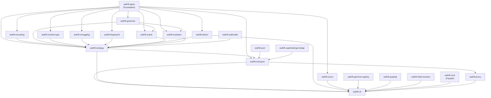

# WafRift Architecture

A single-page reference for contributors and reviewers. Reading time: ~5 minutes.

---

## One-paragraph intent

WafRift is a programmable WAF-evasion engine. Given an attack payload and a
target, it applies encoding × grammar mutation × HTTP smuggling × content-type
confusion × TLS fingerprint rotation in an adaptive feedback loop (hill-climb /
simulated annealing / tabu / novelty search / MAP-Elites) to discover what
bypasses the exact WAF stack in front of the target, then persists the winning
technique chains to a per-WAF gene bank so every subsequent scan against the
same WAF family starts with zero discovery. It also ships active-learning WAF
decompilation (`wafrift model-evade`): L\* membership queries reconstruct the
WAF's decision boundary as a symbolic finite automaton, and bypass candidates
are mined offline against that automaton at ~1 M/s — turning evasion from
search into deduction.

---

## Crate dependency graph



---

## Layer table

| Layer | Crate | One-line role |
|---|---|---|
| **Foundation** | `wafrift-types` | Shared types: `Request`, `Technique`, `EvasionResult`, `Verdict`, `EvasionConfig` |
| **Wire-level mutators** | `wafrift-encoding` | 15+ encoding strategies (URL, Unicode, HTML entity, SQL comment, chunked, invisible chars, …) |
| | `wafrift-grammar` | Grammar-aware mutations — SQL, XSS, CMD, SSTI, path, LDAP, SSRF; variants validate against `sqlparser-rs` AST |
| | `wafrift-content-type` | WAFFLED Content-Type switching — JSON / XML / multipart / form reformatting |
| | `wafrift-smuggling` | CL.TE / TE.CL / TE.TE / CL.0 / H2C / WebSocket smuggling; safe + unsafe-probes feature gate |
| | `wafrift-fingerprint` | Browser UA + TLS JA3/JA4 profile rotation (Chrome, Firefox, Safari, Edge, OkHttp) |
| | `wafrift-graphql` | GraphQL-specific evasion: alias flood, op-name mismatch, introspection whitespace-split |
| | `wafrift-http3-evasion` | QUIC/HTTP3 data-plane primitives: QPACK desync, 0-RTT replay, CID rotation, stream priority topology, MTU fragmentation |
| **Intelligence** | `wafrift-detect` | WAF fingerprinting via HTTP headers + body (160+ vendor rules), DNS CNAME chain, reverse-DNS PTR, BGP ASN |
| | `wafrift-evolution` | Genetic algorithm, MCTS, differential probing, body-padding (inspection-window evasion), WAF-aware advisor |
| | `wafrift-wafmodel` | Active-learning WAF decompiler: L\* / SFA reconstruction, offline bypass mining, ML-WAF evasion, hole-closure synthesis |
| | `wafrift-oracle` | Payload-validity oracles — SQL AST, XSS structure, SSTI delimiters, CMDI shell syntax, path traversal, LDAP, SSRF |
| **Pipeline** | `wafrift-strategy` | Evasion pipeline orchestrator: per-host state (`HostState`), winner rotation, gene bank, MCTS bridge, ML-WAF routing |
| **Runtime** | `wafrift-transport` | Evasion-aware reqwest wrapper: auto-retry, WAF-block detection, session coherence, stealth profiles (`StealthClient`) |
| | `wafrift-pool` | Round-robin HTTP/SOCKS5 proxy pool |
| | `wafrift-recon` | Origin discovery: CT logs (crt.sh), DNS history, CDN/WAF IP filtering |
| | `wafrift-genome-registry` | ed25519 genome signing, `TrustList` publisher allowlist, bundle wire format |
| | `wafrift-captchaforge-bridge` | Headless Chromium adapter (chromiumoxide) for Cloudflare/Akamai/AWS managed challenge solving |
| **Frontend** | `wafrift-core` | Façade crate — re-exports all crates under one namespace for `wafrift-core = "0.2"` consumers |
| | `wafrift-proxy` | Forward HTTP proxy with per-host adaptive evasion, MITM/TLS interception, ratatui TUI |
| | `wafrift-cli` | Binary entry point — all subcommands, `Commands` enum, scan / bench / parser-diff / smuggle / legendary |

---

## Where to add a new X

| What | Where |
|---|---|
| New **encoding strategy** | `crates/encoding/src/encoding/` — add a function, register it in the `Strategy` enum in `strategy.rs`, and add a doctest |
| New **payload grammar** | `crates/grammar/src/grammar/` — add a mutator, extend `PayloadType` + `mutate_as`, add an oracle in `crates/oracle/src/` |
| New **smuggling primitive** | `crates/smuggling/src/smuggling.rs` — add a builder function following the `cl_te` / `te_cl` pattern |
| New **WAF detection rule** | `rules/detect/<vendor>.toml` — five lines of TOML, zero Rust knowledge required |
| New **CLI subcommand** | `crates/cli/src/<name>_cmd.rs` (args struct + `run_<name>`) and add a variant to the `Commands` enum in `main.rs` |
| New **oracle** | `crates/oracle/src/<type>.rs` implementing `PayloadOracle`; register in `oracle_for()` in `lib.rs` |
| New **evolution algorithm** | `crates/evolution/src/evolution.rs` or a new sibling file; wire into the advisor |
| New **GraphQL evasion payload** | `crates/graphql/src/lib.rs` — add a `pub fn` and include it in `all_evasion_payloads()` |
| New **HTTP/3 technique** | `crates/http3-evasion/src/` — add a module, export from `lib.rs`, add a variant to `EvasionTechnique` |
| New **bench scenario** | `wafrift-bench/corpus/` — TOML case file; format documented in `wafrift-bench/methodology.md` |

---

## CLI subcommand index

### Recon
| Subcommand | Role |
|---|---|
| `detect` | Fingerprint WAF/CDN/origin (HTTP headers, DNS CNAME, reverse-DNS, BGP ASN) |
| `discover` | Parse OpenAPI / GraphQL introspection / mine parameters into injection points |
| `recon` | Origin discovery via CT logs + DNS history (authorized targets only) |
| `origin-hints` | DNS hints for origin-bypass (authorized targets only) |

### Scan
| Subcommand | Role |
|---|---|
| `scan` | Fire evasion variants at a live target; report bypass chains; stateful session support |
| `bypass-probe` | 230 auth-bypass header probes + path/method variants (Tsai-class) |
| `evade` | Offline payload mutation — no target required |
| `import-curl` | Parse a Burp "Copy as cURL" capture and run scan |

### Parser-diff family
| Subcommand | Role |
|---|---|
| `attack` | Unified orchestrator — runs all seven parser-diff probes concurrently |
| `parser-diff` | URL-path shape variants (NUL, fullwidth slash, dot-segment, …) |
| `header-diff` | Header-block variants (dup-header, XFF, LWS, Authorization case-mix) |
| `body-diff` | Body-format variants (JSON dup-key, UTF-7, BOM, multipart collision) |
| `query-diff` | Query-string variants (HPP, bracket notation, semicolon separator) |
| `cache-diff` | Cache-key confusion (Host case, param order, fragment leak) |
| `h2-diff` | HTTP/1.1 vs HTTP/2 differential |
| `method-diff` | HTTP method variants (WebDAV, lowercase, H2 preface PRI) |
| `gql-diff` | GraphQL parser disagreements (alias bomb, op-name spoof, introspection) |
| `jwt-diff` | JWT validation scanner (alg:none, kid injection, role elevation) |
| `cors-diff` | CORS misconfiguration scanner (10 origin-validation pitfalls) |
| `trailer-diff` | HTTP chunked-trailer injection |
| `ja3-diff` | TLS fingerprint differential (requires `--features tls-impersonate`) |

### Smuggling
| Subcommand | Role |
|---|---|
| `smuggle` | HTTP request smuggling CLI (CL.TE / TE.CL / CL.0 / detect / dry-run) |

### Attacker utilities
| Subcommand | Role |
|---|---|
| `compress` | Wrap a body in gzip / deflate / brotli chains |
| `distill` | Adversarial ddmin — find the minimal bypass payload (Zeller) |
| `listener` | OOB callback receiver for blind SQLi / stored XSS / SSRF / OOB cmdi |

### Defender (WAF model)
| Subcommand | Role |
|---|---|
| `model-evade` | L\*-active-learning WAF decompiler + offline SFA bypass mining |
| `audit` | X-ray a CRS ruleset; report bypassable holes |
| `harden` | Synthesize closure rules; CI-gateable proof of zero false positives |

### Operator / gene bank
| Subcommand | Role |
|---|---|
| `replay` | Deterministic re-fire of a saved bypass (exits 0 bypass / 2 block) |
| `bank` | Gene-bank management: list / export / import / sign / trust / pull / submit |
| `seed` | Pre-load a gene-bank with known-working techniques |
| `report` | Generate a markdown pentest writeup from the proxy gene-bank |
| `legendary` | One-shot: detect → fingerprint → bypass-probe → polished markdown report |

### Meta
| Subcommand | Role |
|---|---|
| `techniques` | List / explain `--only` / `--exclude` selectors |
| `init` | Scaffold a `.wafrift.toml` in the current directory |
| `completion` | Generate shell completions (bash / zsh / fish / PowerShell) |
| `man` | Generate troff man page |
| `bench-waf` | Measure raw WAF block rate + wafrift bypass rate against a corpus |
| `bench-diff` | Gate on regression between two `bench-waf` JSON blobs |

---

## Data flow

```
Operator input
    │
    ▼
[detect]  WAF fingerprint (HTTP headers + DNS CNAME + PTR + BGP ASN)
    │        → WafClass + evasion preset hints
    ▼
[strategy / planner]  Select technique pipeline
    │  gene bank warm-start (per-WAF winners from ~/.wafrift/genomes/)
    │  MCTS / bandit for unexplored arms
    ▼
[encoding]  Payload encoding (URL, Unicode, HTML entity, SQL comment, …)
    │
    ▼
[grammar]  Grammar mutation (SQL tautology swap, XSS tag rotate, …)
    │  oracle gates each variant (sqlparser-rs AST equivalence)
    ▼
[content-type]  Body format switching (JSON → multipart → XML, …)
    │
    ▼
[smuggling]  Framing manipulation (CL.TE / TE.CL / H2 desync)
    │
    ▼
[fingerprint]  TLS + header-order + UA rotation
    │
    ▼
[transport / EvasionClient]  HTTP send (retry, rate-limit backoff)
    │
    ▼
[oracle]  Classify response → Verdict (bypass / block / challenge / rate-limit)
    │
    ▼
[strategy / gene bank]  Record result → update bandit posteriors
    │  winners persist to ~/.wafrift/genomes/<waf>.json
    ▼
Operator output  (bypass chain, technique recipe, gene bank, markdown report)
```

---

## Future structure (`#82` — CLI carve)

The `crates/cli/src/` directory currently holds ~57 command modules in a flat
layout. Issue #82 tracks a planned carve into four organised subdirectories:

```
crates/cli/src/
├── recon/          detect_cmd, recon_cmd, discover_cmd, origin_hints
├── scan/           scan, evade_cmd, bypass_probe, import_curl, replay
├── parserdiff/     attack_cmd, parser_diff_cmd, header_diff_cmd,
│                   body_diff_cmd, query_diff_cmd, cache_diff_cmd,
│                   h2_diff_cmd, method_diff_cmd, gql_diff_cmd,
│                   jwt_diff_cmd, cors_diff_cmd, trailer_diff_cmd,
│                   ja3_diff_cmd
├── operator/       bank, bank_registry, seed, report, legendary,
│                   listener_cmd, compress_cmd, distill_cmd,
│                   smuggle_cmd, model_evade_cmd, wafmodel_cmd
└── meta/           init_cmd, config, man_cmd, explain, interactive
```

`main.rs` and the `Commands` enum stay in `src/` root. No public API changes —
this is a source-layout reorganisation only. Until #82 lands, the flat layout
is canonical; new command modules go directly into `crates/cli/src/`.
